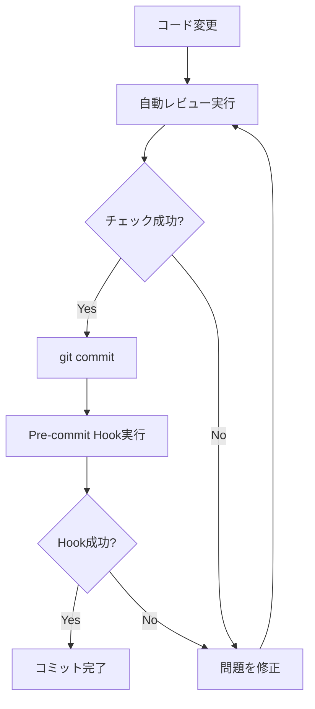

# コードレビューガイド

このドキュメントでは、Tennis Mate 2プロジェクトにおけるコードレビューのプロセスと、GitHub Copilotを活用したレビュー方法を説明します。

## 目次

1. [レビュープロセス概要](#レビュープロセス概要)
2. [自動チェックツール](#自動チェックツール)
3. [GitHub Actionsの手動実行](#github-actionsの手動実行)
4. [GitHub Copilotによるレビュー](#github-copilotによるレビュー)
5. [レビュー基準](#レビュー基準)
6. [よくある問題と解決策](#よくある問題と解決策)

## レビュープロセス概要

### コミット前のチェックフロー



### 推奨ワークフロー

1. **開発**: 機能実装・バグ修正
2. **自動レビュー**: `npm run review` を実行
3. **修正**: 指摘事項を修正
4. **コミット**: `git commit` でコミット（pre-commit hookが自動実行）
5. **プッシュ**: `git push`
6. **PR作成**: GitHub上でプルリクエスト作成
7. **Copilot Review**: GitHub Copilot for PRsによる自動レビュー
8. **人間レビュー**: チームメンバーによるレビュー
9. **マージ**: レビュー承認後にマージ

## 自動チェックツール

### 1. コードレビュースクリプト

包括的な自動チェックを実行:

```bash
npm run review
```

このスクリプトは以下をチェック:
- ✅ コードスタイル（Biome）
- ✅ 型チェック（TypeScript）
- ✅ ビルド成功
- ✅ 単体テスト
- ✅ 統合テスト

**出力例:**
```
🔍 Starting code review checks...

━━━━━━━━━━━━━━━━━━━━━━━━━━━━━━━━━━━━━━━━
📋 Code Style Check
━━━━━━━━━━━━━━━━━━━━━━━━━━━━━━━━━━━━━━━━
✅ Code Style Check passed

━━━━━━━━━━━━━━━━━━━━━━━━━━━━━━━━━━━━━━━━
📋 TypeScript Type Check
━━━━━━━━━━━━━━━━━━━━━━━━━━━━━━━━━━━━━━━━
✅ TypeScript Type Check passed

...

━━━━━━━━━━━━━━━━━━━━━━━━━━━━━━━━━━━━━━━━
📊 Review Summary
━━━━━━━━━━━━━━━━━━━━━━━━━━━━━━━━━━━━━━━━

✅ Passed: 5
❌ Failed: 0

🎉 All checks passed! Ready to commit.
```

### 2. 個別チェックコマンド

特定のチェックのみ実行したい場合:

```bash
# コードスタイルチェック
npm run check

# コードスタイル自動修正
npm run check:write

# 型チェック
npm run typecheck

# ビルドチェック
npm run build

# テスト
npm run test:unit
npm run test:integration
npm run test:e2e
```

### 3. Git Hooks（自動実行）

#### Pre-commit Hook

コミット時に自動実行されるチェック:

```bash
# .husky/pre-commit
- コードスタイルチェック
- 型チェック
- 単体テスト
```

Hookをスキップしたい場合（緊急時のみ推奨）:
```bash
git commit --no-verify -m "message"
```

#### Commit-msg Hook

コミットメッセージの検証:

```bash
# .husky/commit-msg
- メッセージが空でないことを確認
- 推奨フォーマットの警告
```

**推奨フォーマット:**
```
<type>: <subject>

<body>

🤖 Generated with [Claude Code](https://claude.com/claude-code)

Co-Authored-By: Claude <noreply@anthropic.com>
```

**Type一覧:**
- `feat`: 新機能
- `fix`: バグ修正
- `refactor`: リファクタリング
- `test`: テスト追加・修正
- `docs`: ドキュメント
- `style`: コードスタイル
- `chore`: その他（ビルド設定など）
- `perf`: パフォーマンス改善
- `ci`: CI/CD設定

## GitHub Actionsの手動実行

プロジェクトには2つのGitHub Actionsワークフローがあり、どちらも手動で実行できます。

### 1. CI Workflow（通常のCI）

通常のCIワークフローを手動で実行する場合:

**GitHub Web UI:**
1. GitHubリポジトリの「Actions」タブに移動
2. 左サイドバーから「CI」を選択
3. 右上の「Run workflow」ボタンをクリック
4. オプションを選択:
   - **Run E2E tests**: E2Eテストを実行するか（デフォルト: true）
   - **Run integration tests**: 統合テストを実行するか（デフォルト: true）
5. 「Run workflow」をクリック

**GitHub CLI:**
```bash
# すべてのテストを実行
gh workflow run ci.yml

# E2Eテストをスキップ
gh workflow run ci.yml -f run_e2e=false

# 統合テストのみスキップ
gh workflow run ci.yml -f run_integration=false

# 両方スキップ（Lint + 単体テストのみ）
gh workflow run ci.yml -f run_e2e=false -f run_integration=false
```

### 2. Manual Test Run（柔軟なテスト実行）

特定のテストタイプのみを実行したい場合:

**GitHub Web UI:**
1. GitHubリポジトリの「Actions」タブに移動
2. 左サイドバーから「Manual Test Run」を選択
3. 右上の「Run workflow」ボタンをクリック
4. オプションを選択:
   - **Test type to run**: 実行するテストタイプ
     - `all`: すべてのテスト
     - `unit`: 単体テストのみ
     - `integration`: 統合テストのみ
     - `e2e`: E2Eテストのみ
     - `lint-only`: LintとType Checkのみ
   - **Node.js version**: Node.jsバージョン（デフォルト: 20）
5. 「Run workflow」をクリック

**GitHub CLI:**
```bash
# すべてのテストを実行
gh workflow run manual-test.yml -f test_type=all

# 単体テストのみ実行
gh workflow run manual-test.yml -f test_type=unit

# 統合テストのみ実行
gh workflow run manual-test.yml -f test_type=integration

# E2Eテストのみ実行
gh workflow run manual-test.yml -f test_type=e2e

# LintとType Checkのみ実行
gh workflow run manual-test.yml -f test_type=lint-only

# Node.jsバージョンを指定
gh workflow run manual-test.yml -f test_type=all -f node_version=18
```

### 実行結果の確認

**GitHub Web UI:**
1. 「Actions」タブで実行中/完了したワークフローをクリック
2. 各ジョブの詳細を確認
3. テストサマリーを確認（Manual Test Runの場合）

**GitHub CLI:**
```bash
# ワークフローの実行状況を確認
gh run list --workflow=ci.yml

# 特定の実行の詳細を確認
gh run view <run-id>

# ログを確認
gh run view <run-id> --log
```

### 自動実行されるタイミング

GitHub Actionsは以下のタイミングで自動実行されます:

**CI Workflow:**
- `master` または `main` ブランチへのプッシュ
- `master` または `main` ブランチへのプルリクエスト

**Manual Test Run:**
- 手動実行のみ（自動実行なし）

### 使い分け

| シナリオ | 推奨ワークフロー | コマンド例 |
|---------|----------------|-----------|
| PR前の最終チェック | CI Workflow | `gh workflow run ci.yml` |
| 単体テストのみ確認したい | Manual Test Run | `gh workflow run manual-test.yml -f test_type=unit` |
| E2Eテストのみ確認したい | Manual Test Run | `gh workflow run manual-test.yml -f test_type=e2e` |
| Lintと型チェックのみ | Manual Test Run | `gh workflow run manual-test.yml -f test_type=lint-only` |
| 時間を節約したい | CI Workflow（テストをスキップ） | `gh workflow run ci.yml -f run_e2e=false` |

## GitHub Copilotによるレビュー

### 1. VSCode での Copilot Chat レビュー

#### 基本的な使い方

1. **ファイル全体のレビュー:**
   ```
   このファイルをレビューしてください。
   以下の観点でチェックしてください:
   - クリーンアーキテクチャに準拠しているか
   - 型安全性は確保されているか
   - セキュリティ上の問題はないか
   ```

2. **特定のコードブロックのレビュー:**
   - コードを選択
   - Copilot Chatで「選択したコードをレビューしてください」

3. **変更差分のレビュー:**
   ```
   git diffの結果をレビューしてください。
   .github/copilot-instructions.mdのルールに従ってチェックしてください。
   ```

#### プロジェクト固有の質問例

```
# アーキテクチャ確認
このコードはクリーンアーキテクチャの原則に従っていますか？
domain層がインフラストラクチャに依存していませんか？

# セキュリティ確認
このコードにセキュリティ上の問題はありますか？
パスワードが適切に管理されていますか？

# パフォーマンス確認
このコードにパフォーマンス上の問題はありますか？
N+1問題が発生していませんか？

# TypeScript確認
型安全性に問題はありますか？
any型を使わずに実装できますか？
```

### 2. GitHub Copilot for PRs

#### プルリクエスト作成時

GitHub上でPRを作成すると、Copilot for PRsが自動的に:
- コード変更を分析
- レビューコメントを生成
- 改善提案を提示

#### 使用方法

1. **PRを作成:**
   ```bash
   gh pr create --title "feat: add user profile page" --body "ユーザープロフィール画面を追加"
   ```

2. **Copilotのレビューを確認:**
   - GitHubのPRページで自動生成されたコメントを確認
   - 提案された変更を適用または却下

3. **追加の質問:**
   PRのコメント欄でCopilotに質問:
   ```
   @copilot このコードのパフォーマンスを改善できますか？
   @copilot この実装は .github/copilot-instructions.md のルールに従っていますか？
   ```

### 3. カスタムレビュープロンプト

プロジェクト固有のレビュープロンプトを作成:

```markdown
以下の観点でコードをレビューしてください:

**アーキテクチャ:**
- [ ] クリーンアーキテクチャの層構造に従っているか
- [ ] 依存関係の方向が正しいか（外側→内側）
- [ ] domain層がフレームワーク非依存か

**TypeScript:**
- [ ] any型を使用していないか
- [ ] 型アサーションを最小限に抑えているか
- [ ] Zodスキーマから型を推論しているか

**セキュリティ:**
- [ ] パスワードをPassword値オブジェクトで管理しているか
- [ ] 認証・認可が適切か
- [ ] 入力バリデーションが実装されているか

**UI/UX:**
- [ ] 標準のalert/confirmを使用していないか
- [ ] MUIのDialogを使用しているか
- [ ] レスポンシブ対応しているか

参考: .github/copilot-instructions.md
```

## レビュー基準

詳細なチェックリストは以下を参照:
- [コードレビューチェックリスト](../.github/CODE_REVIEW_CHECKLIST.md)
- [Copilot指示書](../.github/copilot-instructions.md)

### 重要度レベル

レビューコメントには以下のプレフィックスを使用:

| レベル | プレフィックス | 説明 | 対応 |
|--------|---------------|------|------|
| 🔴 Critical | `[CRITICAL]` | セキュリティ、データ損失のリスク | 修正必須 |
| 🟠 Important | `[IMPORTANT]` | アーキテクチャ違反、重大なバグ | 修正推奨 |
| 🟡 Suggestion | `[SUGGESTION]` | 改善提案、リファクタリング | 任意 |
| 🔵 Question | `[QUESTION]` | 質問、意図の確認 | 回答 |

### レビューポイント優先度

1. **最優先（必ずチェック）:**
   - セキュリティ脆弱性
   - データ損失のリスク
   - アーキテクチャ違反

2. **高優先:**
   - 型安全性の問題
   - パフォーマンス問題
   - テスト不足

3. **中優先:**
   - コードスタイル
   - 命名規則
   - コメント

4. **低優先:**
   - 細かいリファクタリング
   - 最適化の余地

## よくある問題と解決策

### 1. ビルドエラー

**問題:** `npm run build` が失敗する

**チェック項目:**
- [ ] TypeScript型エラーがないか → `npm run typecheck`
- [ ] 不足している依存関係がないか → `npm install`
- [ ] tsconfig.jsonの設定が正しいか

**解決策:**
```bash
# 型エラーを確認
npm run typecheck

# ビルドキャッシュをクリア
rm -rf .next
npm run build
```

### 2. テスト失敗

**問題:** `npm run test:unit` が失敗する

**チェック項目:**
- [ ] テストデータベースが正しくセットアップされているか
- [ ] 環境変数が設定されているか
- [ ] モックが適切に設定されているか

**解決策:**
```bash
# テストDBをセットアップ
npm run db:setup-e2e

# 特定のテストのみ実行
npm run test:unit -- user.test.ts
```

### 3. コードスタイルエラー

**問題:** `npm run check` が失敗する

**解決策:**
```bash
# 自動修正
npm run check:write

# 安全でない変更も含めて修正（慎重に使用）
npm run check:unsafe
```

### 4. Pre-commit Hook失敗

**問題:** コミット時にhookが失敗する

**チェック項目:**
- [ ] すべてのファイルがステージングされているか
- [ ] テストが成功するか
- [ ] 型エラーがないか

**一時的な回避策（緊急時のみ）:**
```bash
git commit --no-verify -m "message"
```

**推奨される解決策:**
```bash
# 問題を修正してから再度コミット
npm run review
# 問題を修正
git add .
git commit -m "message"
```

### 5. 型エラー

**問題:** TypeScriptの型エラーが解決できない

**よくあるパターン:**

1. **any型を避ける:**
   ```typescript
   // ❌ 悪い例
   const data: any = await fetch();

   // ✅ 良い例
   const data: UserResponse = await fetch();
   ```

2. **Zodスキーマから型を推論:**
   ```typescript
   // ❌ 悪い例
   type User = {
     name: string;
     email: string;
   };

   // ✅ 良い例
   export const userSchema = z.object({
     name: z.string(),
     email: z.string().email(),
   });
   export type User = z.infer<typeof userSchema>;
   ```

3. **オプショナルチェーンを使用:**
   ```typescript
   // ❌ 悪い例
   const name = user.profile.name;

   // ✅ 良い例
   const name = user?.profile?.name;
   ```

## まとめ

### コミット前のチェックリスト

- [ ] `npm run review` を実行して全チェック成功
- [ ] 必要に応じて `npm run check:write` で自動修正
- [ ] 変更内容を確認（`git diff`）
- [ ] 適切なコミットメッセージを作成
- [ ] `git commit` を実行（pre-commit hookが自動実行）

### レビュー依頼時のチェックリスト

- [ ] PRのタイトルと説明が明確
- [ ] 関連するissueがリンクされている
- [ ] スクリーンショットや動作確認結果を添付
- [ ] [CODE_REVIEW_CHECKLIST.md](../.github/CODE_REVIEW_CHECKLIST.md) を確認済み
- [ ] Copilot for PRsのレビューを確認済み

## 参考リンク

- [GitHub Copilot指示書](../.github/copilot-instructions.md)
- [コードレビューチェックリスト](../.github/CODE_REVIEW_CHECKLIST.md)
- [テストガイド](./TESTING.md)
- [プロジェクトガイド](../CLAUDE.md)
